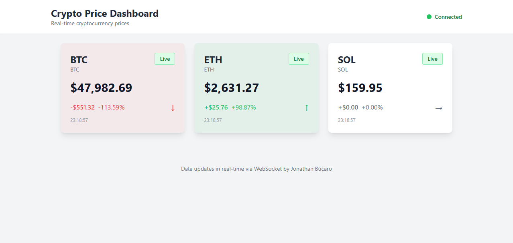
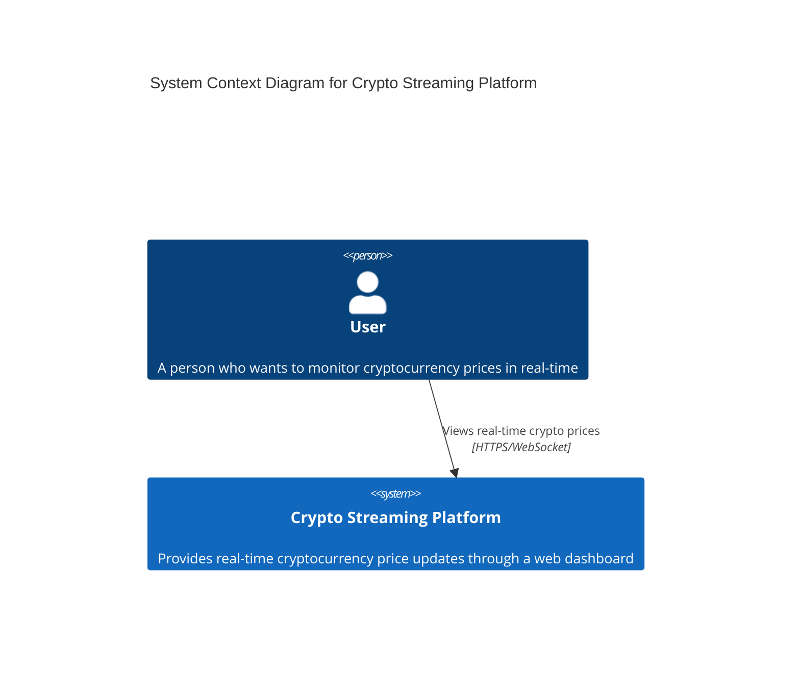
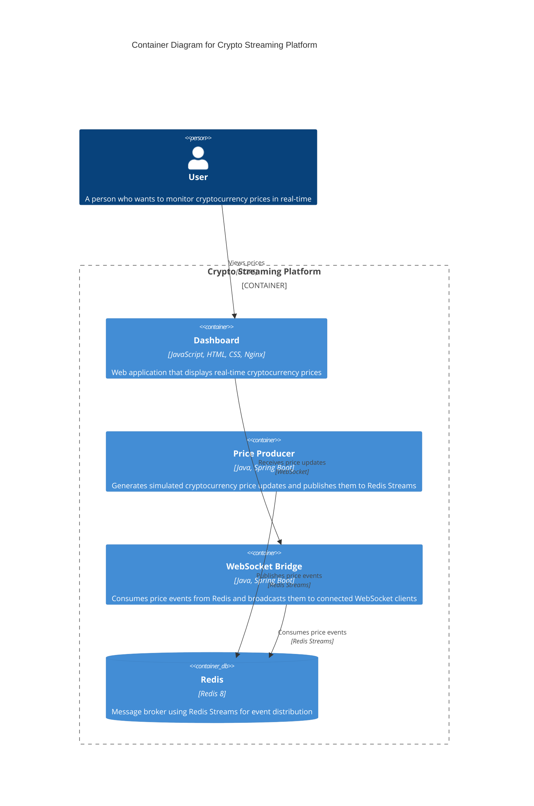
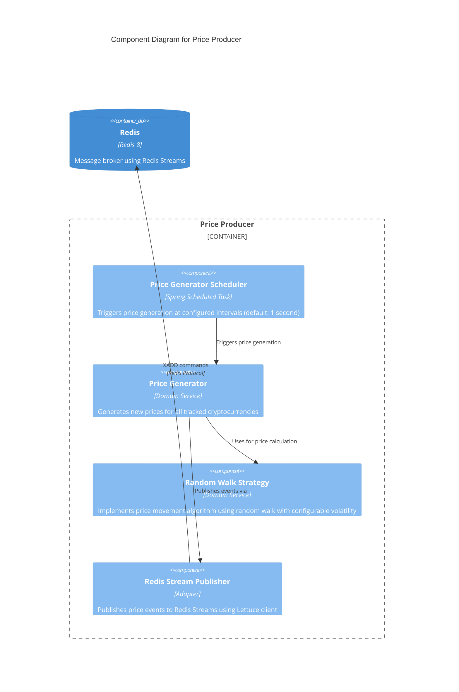
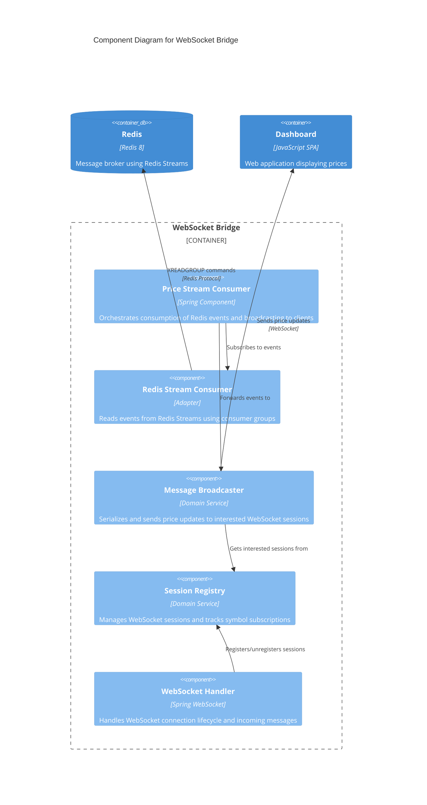
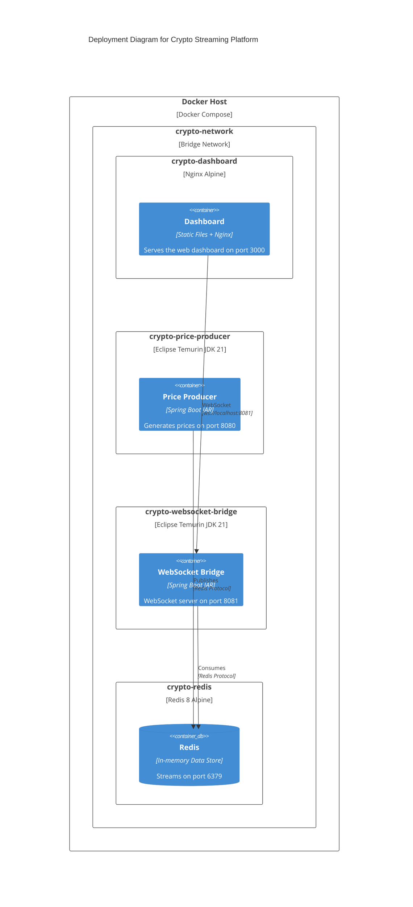

# Crypto Streaming Platform

A Coding Challenge real-time cryptocurrency price streaming platform built with a microservices architecture. The system generates simulated cryptocurrency prices and streams them to connected clients through WebSocket connections.

## Table of Contents

- [Overview](#overview)
- [Architecture](#architecture)
  - [System Context](#system-context)
  - [Container Diagram](#container-diagram)
  - [Component Diagram: Price Producer](#component-diagram-price-producer)
  - [Component Diagram: WebSocket Bridge](#component-diagram-websocket-bridge)
- [Technology Stack](#technology-stack)
- [Getting Started](#getting-started)
- [Services](#services)
- [Configuration](#configuration)

## Overview

The Crypto Streaming Platform is a demonstration project that showcases real-time data streaming using modern technologies. It simulates cryptocurrency price updates and delivers them to web clients through a distributed architecture using Redis Streams as the message backbone.



## Architecture

### System Context

The following diagram shows the high-level system context, illustrating how users interact with the platform.



### Container Diagram

The container diagram shows the main building blocks of the system and how they communicate.



### Component Diagram: Price Producer

The Price Producer service generates simulated cryptocurrency prices using a random walk algorithm and publishes them to Redis Streams.



### Component Diagram: WebSocket Bridge

The WebSocket Bridge service acts as a bridge between Redis Streams and WebSocket clients, enabling real-time price delivery to the dashboard.



### Deployment Diagram

The following diagram shows how the system is deployed using Docker containers.



## Technology Stack

| Component | Technology |
|-----------|------------|
| Price Producer | Java 17, Spring Boot 3, Lettuce (Redis client) |
| WebSocket Bridge | Java 17, Spring Boot 3, Spring WebSocket, Lettuce |
| Dashboard | Vanilla JavaScript, HTML5, CSS3, Nginx |
| Message Broker | Redis 8 with Streams |
| Containerization | Docker, Docker Compose |

## Getting Started

### Prerequisites

- Docker and Docker Compose installed on your system
- (Optional) Java 17 and Maven for local development

### Running the Platform

1. Clone the repository:
   ```bash
   git clone <repository-url>
   cd crypto-streaming
   ```

2. Start all services using Docker Compose:
   ```bash
   docker-compose up -d
   ```

3. Access the dashboard:
   - Open your browser and navigate to `http://localhost:3000`

4. Monitor service health:
   - Price Producer: `http://localhost:8080/actuator/health`
   - WebSocket Bridge: `http://localhost:8081/actuator/health`

### Stopping the Platform

```bash
docker-compose down
```

To remove all data (including Redis volume):
```bash
docker-compose down -v
```

## Services

### Price Producer (Port 8080)

Generates simulated cryptocurrency prices at regular intervals and publishes them to a Redis Stream.

**Key Features:**
- Configurable price generation interval (default: 1 second)
- Random walk algorithm for realistic price movements
- Stream trimming to manage memory usage
- Health endpoint for monitoring

### WebSocket Bridge (Port 8081)

Bridges Redis Streams to WebSocket connections, enabling real-time price delivery to web clients.

**Key Features:**
- Consumer group based consumption for scalability
- Session management with symbol subscription support
- Heartbeat mechanism for connection health
- Configurable batch processing

### Dashboard (Port 3000)

A web-based dashboard that displays real-time cryptocurrency prices.

**Key Features:**
- Real-time price updates via WebSocket
- Automatic reconnection with exponential backoff
- Dynamic price card creation for new symbols
- Visual indicators for price trends (up/down)

## Configuration

### Environment Variables

| Variable | Service | Description | Default |
|----------|---------|-------------|---------|
| `REDIS_HOST` | Price Producer, WebSocket Bridge | Redis server hostname | `localhost` |
| `REDIS_PORT` | Price Producer, WebSocket Bridge | Redis server port | `6379` |
| `HOSTNAME` | WebSocket Bridge | Consumer ID for Redis consumer group | `consumer-1` |

### Application Configuration

#### Price Producer (`application.yml`)

```yaml
crypto:
  redis:
    stream:
      name: crypto:prices        # Redis stream name
      max-length: 10000          # Maximum stream length
  producer:
    interval-ms: 1000            # Price generation interval
```

#### WebSocket Bridge (`application.yml`)

```yaml
crypto:
  redis:
    stream:
      name: crypto:prices        # Redis stream name
      consumer-group: price-consumers
      block-timeout: 5s          # Blocking read timeout
      batch-size: 100            # Messages per batch
  websocket:
    endpoint: /ws/prices         # WebSocket endpoint path
    allowed-origins: "*"         # CORS configuration
    max-sessions: 1000           # Maximum concurrent sessions
```
